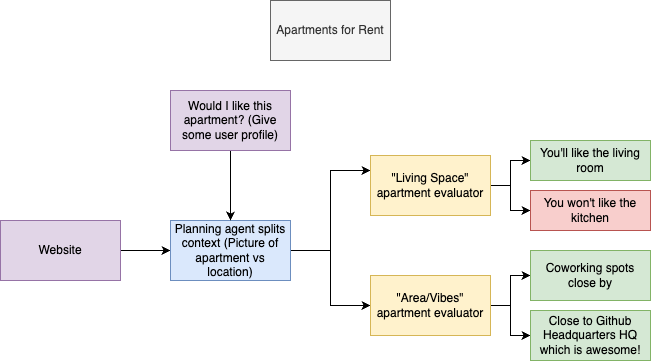

# Weaviate RAG Example

This example demonstrates how to use Weaviate Cloud for Retrieval Augmented Generation (RAG) with OpenAI integration and includes a Brain-Edge system for intelligent apartment recommendations.


## System Overview

The system architecture combines Weaviate's vector search capabilities with a Brain-Edge processing system for intelligent apartment recommendations:



### Key Components:
- **Brain (R1)**: Central coordinator that analyzes queries and delegates tasks
- **Edge Instances (V3)**: Specialized processors for listing analysis and personalization
- **Weaviate Vector Store**: Manages embeddings and semantic search
- **User Context Manager**: Handles profile-based personalization

## Components

1. **Weaviate RAG**: Vector search and generative capabilities
2. **Brain-Edge System**: Intelligent query processing with contextual understanding
3. **Apartment Recommendation System**: Personalized apartment matching

## Setup

1. Install dependencies:
```bash
pip install -r requirements.txt
```

2. Sign up for Weaviate Cloud:
   - Go to [Weaviate Cloud](https://console.weaviate.cloud/)
   - Create an account and set up a cluster
   - Get your cluster URL and API key

3. Create a `.env` file with your API keys:
```bash
WEAVIATE_API_KEY='your-weaviate-cloud-api-key'    # From Weaviate Cloud Console
WEAVIATE_URL='your-cluster-url'                   # Your Weaviate Cloud cluster URL (e.g., https://your-cluster.weaviate.network)
OPENAI_API_KEY='your-openai-api-key'              # From OpenAI platform
```

## Running the Example

1. Run the basic Weaviate RAG example:
```bash
python weaviate_rag_example.py
```

2. Run the Brain-Edge RAG example:
```bash
python rag_brain_edge_example.py
```

### Example Queries for Brain-Edge System

1. **Personal Preference Matching**
```
Q: "Would I like the apartment at 2 Townsend St?"
```
This query analyzes the apartment against your profile preferences, interests, and requirements.

2. **Interest-Based Search**
```
Q: "Find apartments that match my interests"
```
Searches for apartments near locations matching your hobbies and interests from your profile.

3. **Community-Focused Search**
```
Q: "Which apartments are close to tech meetups?"
```
Identifies apartments near tech hubs and community gathering spaces.

4. **Specific Requirements**
```
Q: "Show pet-friendly apartments near my preferred locations"
```
Filters apartments based on pet policies and preferred neighborhoods.

## Features

### Weaviate RAG Features
- Text chunking with overlap
- Vector search using OpenAI embeddings
- Single object text generation
- Grouped text generation
- Semantic search integration

### Brain-Edge System Features
- User context awareness
- Profile-based personalization
- Multi-perspective analysis (Brain + 2 Edge instances)
- Dynamic data loading from files and URLs
- Intelligent query processing

## Data Structure

### User Profile Format (YAML)
```yaml
- name: "John Doe"
  email: "john@example.com"
  interests:
    - "technology"
    - "fitness"
  skills:
    - "programming"
    - "data analysis"
  preferred_locations:
    - "SOMA"
    - "Financial District"
```

### Apartment Listing Format
```json
{
  "price": "$3,500/month",
  "bedrooms": "2 bed",
  "bathrooms": "2 bath",
  "location": "San Francisco, CA",
  "pet_friendly": true,
  "description": "Luxury apartment with city views"
}
```

## Testing

Run the test suite to verify functionality:
```bash
python -m pytest tests/
```

Example test cases:
```python
def test_user_context():
    system = RAGBrainEdgeSystem()
    result = system.get_user_context("john@example.com")
    assert result["name"] == "John Doe"

def test_query_processing():
    system = RAGBrainEdgeSystem()
    result = system.process_query_with_context(
        "Find pet-friendly apartments",
        "john@example.com"
    )
    assert len(result["listings"]) > 0
```

## Notes

- The example uses GPT-4 through OpenAI's API
- Text is chunked into 150-word pieces with 25-word overlap
- The collection is recreated each time for demonstration purposes
- All operations are performed using Weaviate's Python client v4
- Uses Weaviate Cloud for deployment (no local setup needed)

## Additional Resources

- [Weaviate Cloud Documentation](https://weaviate.io/developers/weaviate/installation/weaviate-cloud)
- [OpenAI Documentation](https://platform.openai.com/docs)
- [RAG Best Practices](https://weaviate.io/developers/weaviate/starter-guides/retrieval-augmented-generation)
- [Weaviate Cloud Console](https://console.weaviate.cloud/)

## Troubleshooting

Common issues and solutions:

1. **API Connection Issues**
   ```bash
   Error: Failed to connect to Weaviate
   Solution: Check WEAVIATE_URL and WEAVIATE_API_KEY in .env
   ```

2. **Data Loading Errors**
   ```bash
   Error: Cannot load user profiles
   Solution: Verify data/user_profile.yaml exists and is properly formatted
   ```

3. **Memory Issues**
   ```bash
   Error: Out of memory
   Solution: Reduce chunk size in configuration or process data in batches
   ```

## Contributing

1. Fork the repository
2. Create a feature branch
3. Submit a pull request

Please ensure all tests pass before submitting:
```bash
python -m pytest tests/ -v
```

